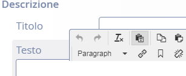
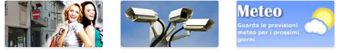

\ |IMG1|\ 

+----------------+
|Pagina 0 di 40  |
|Data: 03.04.2018|
|Rev. 10.5.7     |
|                |
+----------------+

+-------------------------+
|                         |
+-------------------------+
|Gestione portale comunale|
+-------------------------+
|                         |
+-------------------------+

\ |STYLE0|\ 

| `Gestione di base del progetto <#h19667b1a5b2c5531b3ea1029465a2c>`_
|     `Accesso <#h262511183a6b5d4f16397864525b3d49>`_
| `Pagine strutturate (Ufficio, Servizio) <#h6a4f5565625868614372510535d712>`_
|     `Modifica di una pagina ufficio già esistente <#h68283415aa576d66385f616057a4e>`_
|         `Riferimenti dell’ufficio <#h3e347d366b2f1e102456691065e42a>`_
|         `Descrizione uffici <#h5c2d51744f70271f4a38116f3b175e63>`_
|         `Orari di apertura <#h62436714ff2058716617594a3a4b>`_
|         `Allegati/Collegamenti <#h6d4d36734b4d261339e1c604b3b41f>`_
|     `Creazione pagina ufficio <#h375464312553742961f105f74a4221>`_
|     `Creazione pagina Servizio/Procedimento <#h10637362481d29776b57361c4c6e66>`_
|     `Creazione pagine ordinarie <#h716a1053643b68762f1c452423612a5f>`_
|     `Creazione Luoghi <#h50125483d3d2817946766f869287f>`_
|         `Inserimento /modifica di un Luogo <#h392f293b296e494a7b5b6246723ac3>`_
|         `Info generali <#h538165ce2b72783d68392ac57136>`_
|         `Posizione <#h3c7b2a1522737595666325e157a2028>`_
|     `Creazione Rifiuti <#h652a53295552e2c6a797217584c2550>`_
|         `Inserimento /modifica di un Rifiuto <#h5d95a4b1593a623a2d5520772a7a47>`_
|         `Descrizione <#h572b241e5c316743143e261070681a>`_
|         `Date di raccolta <#h4446354c4b43244b605944402b21696d>`_
|     `Pubblicazione <#h1e2d5491f2539617e371c3f5936427e>`_
| `Gestione News <#h60d3b6d4425764b2b6324231566e27>`_
|         `Inserimento/modifica delle news: <#ha2b7d5b6147677266c6537604444e>`_
|         `Informazioni generali <#h3e7924732e5d6c61201c3c253c124b3d>`_
|         `Corpo della notizia <#h56662531294b12704f2c29145349192b>`_
|         `Collegamenti <#h7968605f3a4649101b116c562338495d>`_
| `Gestione app <#h2d496a362e52614db73153867282942>`_
|     `Numeri telefonici <#h56186a2359381c9761019352932859>`_
|     `Notifiche <#ha171d27353e22284d643e152b5c6615>`_
| `Gestione cartelle documenti/immagini in area di lavoro – Explorer <#h637e735e94a6f2f481ce397271527e>`_
|         `Suddivisione delle cartelle documenti e immagini <#h2b244e4340347a30123f2185957759>`_
|         `Caricamento documenti/immagini <#h77536272226398a6e2b5c60414d6a>`_
| `Amministrazione Trasparente <#h6c66692c2a6262374a25355850204a69>`_
|     `Modifica contenuti pagina e aggiunta nuove sezioni di documenti <#h393549255c74f1f7f2c5b5b4c62d>`_
|     `Creazione nuova cartella per i documenti <#h7b68431c2634b82670551e1b2c4f29>`_
|         `Impostazioni ulteriori <#h296171b451534e79361766791564a>`_
| `Immagini <#h2a4f1a56624f4d3211791e24215d472a>`_
|     `Immagini per notizie ed eventi <#h6147742d421d7c7cb622d722814152>`_
|         `Le immagini panoramiche <#hd1a2d3e5536272d187871373374a14>`_
|         `Le immagini per le aree <#h69262932615c3f6f245831b2e3a5e38>`_
|         `Le immagini dei banner <#h63754c6d1c7d203a144314132c364767>`_
|         `Logo ufficiale del Comune <#h596165613c3f55511432b7e1f60713>`_
|     `Formati consigliati per tutte le immagini: jpg, gif e png <#he1b4679723f72562255671a4a221a42>`_
|         `Immagini free dal web <#h151a3a2b411154d533a4b7c6a47280>`_
| `Creazione pagine vuote per uffici, servizi, pagine generiche (container page) <#h7c776b7c444e6361268443ff2f763>`_
| `Suggerimenti per una migliore comunicazione <#h5a7b2954372830f13262e422f3f145f>`_
|         `Testo <#h60367753e78321457d692551633630>`_
|         `Immagini <#h2a4f1a56624f4d3211791e24215d472a>`_
|         `Link <#h69193759306e5406a28415467f3475>`_
| ` <#h2c1d74277104e41780968148427e>`_

.. _h19667b1a5b2c5531b3ea1029465a2c:

Gestione di base del progetto
*****************************

.. _h262511183a6b5d4f16397864525b3d49:

Accesso
=======

Per collegarsi al progetto opencms, digitare nella barra degli indirizzi del browser il seguente percorso: 

\ |LINK1|\  

\ |IMG2|\ 

Dopo aver inserito le proprie credenziali nella finestra di accesso,  il sito del Comune apparirà in modalità area di lavoro o (workplace).

\ |IMG3|\ 

L’area di lavoro ricorda \ |STYLE1|\  di Windows perché tutte le voci di menu presenti nel sito vengono qui visualizzate sotto forma di cartelle e file.

Dall’area di lavoro  Explorer, per passare alla visualizzazione del sito in modalità offline, cliccare sul simbolo della \ |STYLE2|\   sul menu in alto a destra e accedere dal  \ |STYLE3|\  in \ |STYLE4|\ 

\ |IMG4|\ 

A questo punto ci si trova  in Page editor ovvero l’area di gestione del sito: 

\ |IMG5|\ 

Si noterà subito, sotto al banner, la presenza di mirini, che sono i simboli di gestione caratteristici di Opencms 

Il \ |STYLE5|\   identifica la possibilità di editare una qualsiasi sezione nel sito, altrimenti  in mancanza di questo, per eventuali modifiche, bisogna rivolgersi allo sviluppatore.

.. _h6a4f5565625868614372510535d712:

Pagine strutturate (Ufficio, Servizio)
**************************************

Per i portali organizzati in aree, (es. Politiche sociali, scuola, edilizia, urbanistica e commercio, ambiente e territorio, tributi ) qualsiasi tipo di contenuto va analizzato e  posizionato  nell’area specifica.

Dal menu superiore, selezionare la voce: “Aree” e scegliere l’area di pertinenza. Nel menu a destra della pagina dell’area, digitare Elenco uffici o Elenco procedimenti a seconda se si vuole aggiungere/modificare o eliminare un ufficio o un procedimento/servizio.

.. _h68283415aa576d66385f616057a4e:

Modifica di una pagina ufficio già esistente
============================================

Posizionarsi nella pagina ufficio da modificare.

Sfiorando con il mouse il simbolo del bersaglio che si trova nell’angolo in alto a destra, selezionare il simbolo della \ |STYLE6|\  che dà la possibilità di accedere alla pagina da modificare.

In generale, la matita è lo strumento che consente l’attività di editing di qualsiasi oggetto in opencms (ufficio, servizi, pagine ordinarie ecc.)

Cliccando sulla matita nella pagina ufficio, si è di fronte a un documento strutturato composto da diversi segmenti/tab che possono essere personalizzati e che corrispondono ai vari gruppi di informazioni che costituiscono l’ufficio.

* Riferimenti dell’ufficio

* Orari di apertura

* Allegati/Collegamenti

Si noterà subito che il simbolo “\ |STYLE7|\  “ è presente varie volte a destra della pagina. 
Questo \ |STYLE8|\  sta a significare che è possibile aggiungere un  “blocco” ovvero  un paragrafo in più alla pagina per poter scrivere altro testo personalizzando a proprio piacimento  i contenuti.

Dopo ogni modifica, va salvato il lavoro fatto tramite i tasti in alto a sinistra che permettono di salvare le modifiche, pubblicarle direttamente o annullarle.

.. _h3e347d366b2f1e102456691065e42a:

Riferimenti dell’ufficio
------------------------

In questa sezione possono essere modificati  il \ |STYLE9|\  (che compare come titolo della pagina) e tutti i \ |STYLE10|\  che si vogliono evidenziare per l’ufficio (indirizzo, responsabili, contatti di vario tipo).

I riferimenti sono modulari: lo strumento permette di aggiungere, togliere, modificare, spostare di ordine ogni singolo riferimento composto di una Etichetta e di un dato.

Es. Telefono (etichetta) 035 333333 (dato)

La voce  \ |STYLE11|\  permette  di legare l’ ufficio ad una sezione specifica attraverso la definizione di una “chiave” comune tra gli oggetti.

Es.

\ |IMG6|\ 

Per attivare la visualizzazione delle \ |STYLE12|\  a lato dei  singoli Riferimenti, bisogna selezionare il “Tipo” e compilare le “Etichette” scrivendo nel modo seguente:

* Indirizzo

* Tel

* Fax

* E-mail

* Cellulare

* Responsabile del servizio

Infine compilare il campo valore inserendo il testo.

.. _h5c2d51744f70271f4a38116f3b175e63:

Descrizione uffici
------------------

Questo segmento articola il corpo principale della pagina nel quale è possibile aggiungere tutta la parte descrittiva per \ |STYLE13|\ , accompagnati  se lo si desidera, da \ |STYLE14|\  e \ |STYLE15|\ .

\ |STYLE16|\  per quanto riguarda la scrittura di testi.

Quando si intende copiare del testo da altra fonte, va selezionato il tasto  con la \ |STYLE17|\ 

\ |IMG7|\ 

Che permette di “pulire” da eventuali formattazioni copiate e che non rispondono ai requisiti di accessibilità.

.. _h62436714ff2058716617594a3a4b:

Orari di apertura
-----------------

In un blocco stilizzato appositamente, vengono inseriti all’interno della pagina pubblica gli orari dell’uffici.

Il segmento \ |STYLE18|\  permette in modo ordinato di precisare gli archi temporali di servizio per ogni giorno della settimana.

.. _h6d4d36734b4d261339e1c604b3b41f:

Allegati/Collegamenti
---------------------

Qui è possibile integrare ogni singolo allegato da associare alla pagina così pure i collegamenti.

\ |IMG8|\ 

\ |STYLE19|\  va scritto un titolo generico per es. Allegati o Modulistica che raggruppa 1 o più documenti che si vogliono allegare

\ |STYLE20|\  è il titolo del singolo documento 

\ |STYLE21|\  è l’url del documento che si trova nel sito. Cliccando sul simbolo a lato della cartella di download, si visualizza la seguente finestra: 

\ |IMG9|\ 

Che permette di scegliere e selezionare uno o più files , già caricati nel file system.

A questo punto si rimanda alla sezione del manuale che descrive la Gestione cartelle documenti/immagini in area di lavoro – Explorer.

Analogamente per i \ |STYLE22|\  a siti web esterni o pagine interne verranno indicati:

\ |STYLE23|\  va scritto un titolo generico per es. Link utili che raggruppa 1 o più collegamenti

\ |STYLE24|\  è il titolo del singolo collegamento 

\ |STYLE25|\   L’indirizzo web, se esterno,  deve essere assoluto e preceduto  da  \ |STYLE26|\  
se interno al sito, va inserito solo il percorso relativo omettendo \ |LINK2|\ 
e inserendo solo il percorso della pagina : 
“ /comune/uffici-comunali/elenco-uffici/Ufficio-Segreteria-e-Affari-Generali/”

.. _h375464312553742961f105f74a4221:

Creazione pagina ufficio
========================

Se si vuole aggiungere al portale un nuovo ufficio bisogna creare una pagina strutturata di tipo Ufficio

Per aggiungere una pagina ufficio si deve:

* cliccare sul pulsante “Crea pagina” (evidenza 1) tasto “Bacchetta magica”

* tra i vari oggetti presenti, scegliere quello desiderato

* trascinare l’oggetto desiderato all’interno della pagina vuota (\ |STYLE27|\ )
* 
* 

\ |IMG10|\ 

Il \ |STYLE28|\  dell’oggetto: \ |STYLE29|\   e \ |STYLE30|\   va eseguito con attenzione nello spazio tratteggiato in rosso\ |STYLE31|\  Di seguito cliccare sul simbolo della matita e per ottenere lo scheletro di pagina sotto riportato:

\ |IMG11|\ 

In questo caso siamo di fronte a un \ |STYLE32|\  composto di diverse segmenti che andranno personalizzati in ogni sezione.

.. _h10637362481d29776b57361c4c6e66:

Creazione pagina Servizio/Procedimento
======================================

Il servizio, come l’ufficio, è un documento strutturato composto di diversi segmenti.

\ |IMG12|\ 

In “Descrizione” ci sono  i seguenti campi:

\ |STYLE33|\  in cui viene indicato il nome del servizio

\ |STYLE34|\  che permette di introdurre un link che permetta di andare verso l’Ufficio indicato.

\ |STYLE35|\  permettono  di legare il servizio ad un argomento/sezione attraverso la definizione di una “chiave” comune tra gli oggetti.

\ |STYLE36|\  Questo segmento ripropone esattamente quanto visto per l’ufficio. Qui è possibile integrare ogni singolo allegato da associare alla pagina così pure i collegamenti.

.. _h716a1053643b68762f1c452423612a5f:

Creazione pagine ordinarie
==========================

Se si volesse aggiungere al portale del contenuto non che non sia né di tipo uffici né di tipo servizi, si dovrà  optare per una pagina di tipo ordinario.

Per aggiungere una pagina  ordinaria in un qualsiasi punto del sito si deve:

* cliccare sul pulsante “Crea pagina” (evidenza 1) tasto “Bacchetta magica”

* tra i vari oggetti presenti, scegliere quello desiderato

* trascinare l’oggetto desiderato all’interno della pagina vuota (\ |STYLE37|\ )
* 
* 

\ |IMG13|\ 

Il \ |STYLE38|\  dell’oggetto: \ |STYLE39|\   e \ |STYLE40|\   va eseguito con attenzione nello spazio tratteggiato in rosso\ |STYLE41|\  Di seguito cliccare sul simbolo della matita e per ottenere lo scheletro di pagina sotto riportato:

\ |IMG14|\ 

In questo caso siamo di fronte a un documento strutturato simile a quelli precedenti ma più semplice e con  meno sezioni.

.. _h50125483d3d2817946766f869287f:

Creazione Luoghi
================

\ |STYLE42|\ 

Per creare un nuovo Luogo, procedere in questo modo:

* sfiorare con il mouse il simbolo del mirino

* cliccare sul simbolo \ |STYLE43|\   \ |STYLE44|\  

    Per \ |STYLE45|\  un luogo già esistente, cliccare sul simbolo della \ |STYLE46|\  

    Per \ |STYLE47|\  un luogo, cliccare sul simbolo del \ |STYLE48|\ 

A questo punto si procede con la compilazione dei contenuti veri e propri.

.. _h538165ce2b72783d68392ac57136:

Info generali
-------------

\ |IMG15|\ \ |STYLE49|\   (ad esempio:  Campo da tennis)

\ |STYLE50|\  (settare il tipo dalla lista dei luoghi: Impianto sportivo, Biblioteca, Chiesa, Cinema/Teatro, Edificio, Farmacia, ecc )

\ |STYLE51|\ 
Breve descrizione che si visualizza nella lista

\ |STYLE52|\    Inserire la descrizione dettagliata del luogo per es.: 

“Il centro  dispone di \ |STYLE53|\  in terra rossa, di cui 1 coperto. C'è inoltre un \ |STYLE54|\ , coperto, in cui è possibile giocare anche la sera grazie all'impianto di illuminazione artificiale. Gli spogliatoi sono tre (escluso quello per l'arbitro), luminosi e spaziosi.”

\ |STYLE55|\  

Inserire un numero (1,2,3) in caso si voglia dare un ordine di priorità nella lista della pagina

\ |STYLE56|\  

L’immagine deve essere caricata nel progetto e quindi richiamata all’interno di questo documento strutturato. Non è strettamente necessario caricare un’immagine delle esatte dimensioni utili: il programma effettua una attività di ridimensionamento. E’ comunque opportuno caricare un’immagine non troppo grande e di forma quadrata o rettangolare/panoramica (più lunga di base che di altezza).

.. _h3c7b2a1522737595666325e157a2028:

Posizione
---------

\ |STYLE57|\   (ad esempio:  via C. Nembrini) Quanto scritto sarà visibile nella pagina principale

\ |IMG16|\ 

\ |STYLE58|\  Cliccando sul simbolo della cartella a destra si visualizza una mappa:

\ |IMG17|\ 

Digitando l’indirizzo, verranno visualizzati  in automatico dei suggerimenti per aiutare nella compilazion. Una volta scelto l’indirizzo verranno visualizzate latitudine e longitudine

\ |STYLE59|\  In questa sezione possono essere aggiunti  il Nome del Contatto  e tutti i riferimenti che si vogliono evidenziare (indirizzo, E-mail, telefono).

I riferimenti sono modulari: lo strumento permette di aggiungere, togliere, modificare, spostare di ordine ogni singolo riferimento composto di una Etichetta e di un dato.

Es. Telefono (etichetta) 035 333333 (dato)

\ |STYLE60|\ 

.. _h652a53295552e2c6a797217584c2550:

Creazione Rifiuti
=================

\ |STYLE61|\ 
Per creare un nuovo Rifiuto, procedere in questo modo:

* sfiorare con il mouse il simbolo del mirino

* cliccare sul simbolo \ |STYLE62|\   \ |STYLE63|\  

    Per \ |STYLE64|\  un rifiuto già esistente, cliccare sul simbolo della \ |STYLE65|\  

    Per \ |STYLE66|\  un rifiuto, cliccare sul simbolo del \ |STYLE67|\ 

A questo punto si procede con la compilazione dei contenuti veri e propri.

.. _h572b241e5c316743143e261070681a:

Descrizione
-----------

\ |IMG18|\ 

\ |STYLE68|\   indicare il tipo di rifiuto ad esempio:  Carta, vetro, lattine, umido)

\ |STYLE69|\  scegliere  un’immagine o una foto sul tipo di rifiuto es. bidoni, cassonetti, tipo rifiuto particolare ecc )

\ |STYLE70|\ 
Descrizione del rifiuto

\ |STYLE71|\    Descrizione di cosa non va messo

\ |STYLE72|\ 

Modalità di raccolta, es. porta a porta, presso la piattaforma ecologica, piattaforma mobile 

Modalità temporali: es. tutti i venerdì oppure periodo invernale.

\ |STYLE73|\ 

* Per i comuni con una zona unica di raccolta, il campo va lasciato vuoto.

* Pe i comuni con più zone da selezionare, va preventivamente compilato l’oggetto “zona” entrando in Explorer, nella cartella : /.categories/zona-rifiuti/ dove si possono creare e gestire le cartelle coi nomi delle varie zone rifiuto (es. zona nord oppure  centro città, area industriale)

    A questo punto dopo aver creato i vari oggetti “zona” è possibile selezionare  la zona della città  dal menu a tendina nell’editor di testo.

\ |STYLE74|\ 

Selezionare l’icona dall’elenco

\ |STYLE75|\ 
Selezionare il colore per l’icona che potrebbe essere lo stesso per i sacchi della raccolta.

.. _h4446354c4b43244b605944402b21696d:

Date di raccolta
----------------

\ |IMG19|\ 

\ |STYLE76|\  
Questo campo non è visualizzabile sull’app. serve solamente per gestire raggruppamenti  che si svolgono nell’arco di un periodo di tempo

\ |STYLE77|\  

\ |IMG20|\ 

Dove la valorizzazione del campo descrizione: “Settembre 2017” , serve solo per organizzare le date che verranno scritte di seguito.

Infatti se si vuole che sull’app compaiano date o orari particolari, vanno indicate nel campo: \ |STYLE78|\ 

\ |STYLE79|\ 
E’ la data futura della raccolta del rifiuto. Tale data permette la visualizzazione sul calendario rifiuti.

l' ora non vien visualizzata. 

N.B. Non esistono legami con le notifiche push

.. _h1e2d5491f2539617e371c3f5936427e:

Pubblicazione
=============

L’attività di pubblicazione va fatta per poter visualizzare le \ |STYLE80|\  nel \ |STYLE81|\ .

Si raccomanda di lavorare sempre con \ |STYLE82|\  browser  differenti. Uno, in cui si effettuano le modifiche di  gestione e l’altro per controllare, a pubblicazione avvenuta, il buon esito della modifica effettuata.

\ |IMG21|\ 

Il simbolo dell’\ |STYLE83|\ , apre la finestra seguente:

\ |IMG22|\ 

Se viene selezionata la  pagina corrente, verranno pubblicate le modifiche fatte nella pagina in cui ci si trova. Altrimenti  si possono selezionare “le mie modifiche” oppure “tutto il progetto offline” e poi pubblicare.

Anche le singole attività da pubblicare possono essere selezionate, valorizzando la casella di controllo specifica.

Da Explorer, è possibile visualizzare cosa è stato pubblicato e cosa ancora è visibile solo offline.

\ |STYLE84|\  ricorda che il file deve essere ancora pubblicato e per essere visualizzato on line: tasto dx del mouse e pubblica direttamente.

In caso di pubblicazione errata, si può sempre ripristinare la versione precedente in questo modo: 

da Explorer, una volta identificato il file da ripristinare, tasto dx del mouse, cronologia, una finestra  consente il ripristino della versione precedente alla modifica fatta.

.. _h60d3b6d4425764b2b6324231566e27:

Gestione News
*************

.. _ha2b7d5b6147677266c6537604444e:

Inserimento/modifica delle news:
--------------------------------

Posizionarsi nella sezione del sito di news ed eventi

Per creare una nuova pagina es. notizia, procedere in questo modo:

* sfiorare con il mouse il simbolo del mirino 

* cliccare sul simbolo \ |STYLE85|\   \ |STYLE86|\  

#. Per \ |STYLE87|\  una notizia già esistente, cliccare sul simbolo della \ |STYLE88|\  

#. Per \ |STYLE89|\  una notizia, cliccare sul simbolo del \ |STYLE90|\ 

Una volta aperto il dettaglio della novità, per eseguire la modifica o un nuovo inserimento, vengono visualizzati una serie di tab che corrispondono ai vari gruppi di informazioni che costituiscono la novità.

I tasti nella parta alta permettono di salvare le modifiche, pubblicarle direttamente o annullarle.

A questo punto si procede con la compilazione dei contenuti veri e propri della notizia.

.. _h3e7924732e5d6c61201c3c253c124b3d:

Informazioni generali
---------------------

\ |IMG23|\ 

Si tratta d’informazioni descrittive che compaiono nel dettaglio della news.

\ |STYLE91|\  è il titolo della notizia

La voce \ |STYLE92|\  permette, se richiesto, di legare la novità ad un argomento attraverso la definizione di una “chiave” comune tra gli oggetti.

La voce \ |STYLE93|\  permette, di definire il tipo di news: Notizia – Evento –Primo piano

\ |STYLE94|\  la notizia appare \ |STYLE95|\  nella sezione centrale in home page

\ |STYLE96|\  attiva l’invio di una newsletter

\ |STYLE97|\   E’ la data di inizio evento e  costituisce il criterio in base al quale Notizie ed Eventi vengono “ordinati” per essere visualizzati sul sito.

Il comportamento dei 2 tipi di news segue criteri di priorità differenti :

* gli \ |STYLE98|\  vengono ordinati nel modo seguente : \ |STYLE99|\  (da oggi in poi). Gli eventi  vecchi non vengono più visualizzati

* le \ |STYLE100|\  vengono ordinate secondo l’ordine di pubblicazione: \ |STYLE101|\ . Questo comportamento può essere modificato intervenendo sulla data di pubblicazione di una notizia

Nell’elenco a destra in home page,  vengono visualizzati solo alcune Notizie e alcuni Eventi. Se c’è l’esigenza di far comparire una news specifica, bisognerà “giocare” sulla Data di pubblicazione, modificando le altre.

\ |STYLE102|\  : non visualizza più evento e notizia da quella data in poi, dalla home page e dalla pagina principale di lista eventi e notizie e rimane in archivio

\ |STYLE103|\  E’ possibile inserire una data descrittiva (Es: “L’ultima domenica del mese”)

.. _h56662531294b12704f2c29145349192b:

Corpo della notizia
-------------------

\ |IMG24|\ 

\ |STYLE104|\  – In homepage i primi piani e gli eventi hanno associato un’immagine che va definita in questa sezione.

L’immagine deve essere caricata nel progetto e quindi richiamata all’interno di questo documento strutturato. Non è strettamente necessario caricare un’immagine delle esatte dimensioni utili: il programma effettua una attività di ridimensionamento. E’ comunque opportuno caricare un’immagine non troppo grande e di forma quadrata o rettangolare/panoramica (più lunga di base che di altezza).

\ |STYLE105|\  \ |STYLE106|\ \ |STYLE107|\ 

\ |STYLE108|\  – Questa nota testuale unitamente al titolo compare sia in homepage (solo per i primi piani) che nella pagina di elenco delle novità.

\ |STYLE109|\ 

Costituisce il cuore della notizia. 
Qui viene messo il titolo, il testo e un immagine che vengono mostrati nel dettaglio.

Il paragrafo è una sorta di blocco che può essere ripetuto più volte selezionando il +

L’immagine può essere preventivamente caricata oppure caricata al momento.

Per l’immagine può  essere definita la posizione rispetto al testo e l’eventuale didascalia: sopra, sotto, destra e sinistra.

.. _h7968605f3a4649101b116c562338495d:

Collegamenti
------------

\ |IMG25|\ 

\ |STYLE110|\  Qui è possibile integrare ogni singolo allegato da associare alla pagina così pure i collegamenti.

\ |STYLE111|\  – \ |STYLE112|\  insieme alla \ |STYLE113|\  definiscono  l’inizio e la fine della “visibilità” della notizia, al di fuori di quest’intervallo la notizia “scompare” dal portale, anche se esiste ancora in Explorer sotto /.content/..

Se non viene specificata una data in disponibilità , la notizia/evento viene resa visibile agli utenti all'istante perché prende come default la data e ora odierna.

Se è necessario che una notizia/evento sia visualizzabile agli utenti solo dopo una certa data è possibile usare il campo disponibilità (data e ora rilascio).

.. _h2d496a362e52614db73153867282942:

Gestione app
************

\ |IMG26|\ 

Dalla voce di menu \ |STYLE114|\   (non visibile online),  è possibile gestire  Numeri telefonici e Notifiche per l’applicazione per i cellulari.

.. _h56186a2359381c9761019352932859:

Numeri telefonici
=================

Posizionarsi in Gestione e cliccare su Numeri telefonici

Per creare un nuovo numero telefonico, procedere in questo modo:

* sfiorare con il mouse il simbolo del mirino 

* cliccare sul simbolo \ |STYLE115|\   \ |STYLE116|\  

#. Per \ |STYLE117|\  un numero già esistente, cliccare sul simbolo della \ |STYLE118|\  

#. Per \ |STYLE119|\  un numero, cliccare sul simbolo del \ |STYLE120|\ 

Una volta aperto il dettaglio della pagina, procedere alla compilazione .

\ |IMG27|\ 

Una volta salvata la pagina e pubblicata, potrà essere visibile sull’applicazione dello smartphone nel modo seguente

\ |IMG28|\ 

.. _ha171d27353e22284d643e152b5c6615:

Notifiche
=========

Per le notifiche, procedere come per i numeri telefonici.

La maschera di compilazione dal sito è la seguente. 

\ |IMG29|\  

Una volta salvata la pagina e pubblicata, potrà essere visibile sull’applicazione dello smartphone nel modo seguente

\ |IMG30|\ 

.. _h637e735e94a6f2f481ce397271527e:

Gestione cartelle documenti/immagini in area di lavoro – Explorer
*****************************************************************

Accedere ad  Explorer dopo aver cliccato sulla Navicella 

\ |IMG31|\ 

\ |STYLE121|\ 

In Explorer, nella cartella \ |STYLE122|\   si trovano:  la cartella \ |STYLE123|\  per le foto e la cartella \ |STYLE124|\  per i moduli, documenti vari\ |STYLE125|\  

\ |IMG32|\ 

Dalla \ |STYLE126|\  “Create new  resource”, selezionare “Folders” e fare doppio click sulla cartella desiderata: Image gallery per le immagini , Download gallery per i documenti.

In seguito verrà chiesto di inserire il nome e il titolo della nuova galleria.

\ |IMG33|\ 

.. _h2b244e4340347a30123f2185957759:

Suddivisione delle cartelle documenti e immagini
------------------------------------------------

Per facilitare all’utente la gestione delle gallery, sono state create preventivamente   Cartelle documenti e Cartelle immagini seguendo  la seguente logica:

* per uffici (ufficio anagrafe, ufficio commercio, ufficio ragioneria ecc.)

* per tipo di contenuto (amministratori, associazioni, bandi, ecc )

    N.B. Questa suddivisione non vale per l’Amministrazione Trasparente

+-----------------------+-----------------------+
|\ |STYLE127|\          |                       |
+-----------------------+-----------------------+
|\ |STYLE128|\          |\ |STYLE129|\          |
+-----------------------+-----------------------+
|ufficio-anagrafe       |Ufficio Anagrafe       |
+-----------------------+-----------------------+
|ufficio-biblioteca     |Ufficio Biblioteca     |
+-----------------------+-----------------------+
|ufficio-cimitero       |Ufficio Cimitero       |
+-----------------------+-----------------------+
|ufficio-commercio      |Ufficio Commercio      |
+-----------------------+-----------------------+
|ufficio-cultura-sport  |Ufficio Cultura e Sport|
+-----------------------+-----------------------+
|ufficio-elettorale     |Ufficio Elettorale     |
+-----------------------+-----------------------+
|ufficio-ragioneria     |Ufficio Ragioneria     |
+-----------------------+-----------------------+
|ufficio-scuola         |Ufficio Scuola         |
+-----------------------+-----------------------+
|ufficio-segreteria     |Ufficio Segreteria     |
+-----------------------+-----------------------+
|ufficio-servizi-sociali|Ufficio Servizi Sociali|
+-----------------------+-----------------------+
|ufficio-stato-civile   |Ufficio Stato Civile   |
+-----------------------+-----------------------+
|ufficio-tributi        |Ufficio Tributi        |
+-----------------------+-----------------------+
|ufficio-tecnico        |Ufficio Tecnico        |
+-----------------------+-----------------------+
|ufficio-polizia        |Ufficio Polizia        |
+-----------------------+-----------------------+
|ufficio-protocollo     |Ufficio Protocollo     |
+-----------------------+-----------------------+
|ufficio-territorio     |Ufficio Territorio     |
+-----------------------+-----------------------+
|ufficio-urp            |Ufficio URP            |
+-----------------------+-----------------------+
|\ |STYLE130|\          |                       |
+-----------------------+-----------------------+
|amministratori         |Amministratori         |
+-----------------------+-----------------------+
|associazioni           |Associazioni           |
+-----------------------+-----------------------+
|atti                   |Atti                   |
+-----------------------+-----------------------+
|bandi-concorsi         |Bandi e Concorsi       |
+-----------------------+-----------------------+
|eventi-news            |Eventi e News          |
+-----------------------+-----------------------+
|notiziari              |Notiziari              |
+-----------------------+-----------------------+
|\ |STYLE131|\          |                       |
+-----------------------+-----------------------+
|\ |STYLE132|\          |\ |STYLE133|\          |
+-----------------------+-----------------------+
|uffici                 |Uffici                 |
+-----------------------+-----------------------+
|amministratori         |Amministratori         |
+-----------------------+-----------------------+
|associazioni           |Associazioni           |
+-----------------------+-----------------------+
|loghi-banner           |Loghi e Banner         |
+-----------------------+-----------------------+
|eventi-news            |Eventi e News          |
+-----------------------+-----------------------+
|header                 |Header                 |
+-----------------------+-----------------------+
|gallerie-fotografiche  |Gallerie Fotografiche  |
+-----------------------+-----------------------+
|immagini-homepage      |Immagini Homepage      |
+-----------------------+-----------------------+
|territorio             |Territorio             |
+-----------------------+-----------------------+

Questa suddivisione può essere ovviamente modificata a piacimento secondo le esigenze del Comune.

La modalità di scrittura del nome e titolo delle cartelle, ha una sua importanza nell’archivio, per una questione di ordine e funzionalità.

In Explorer, per ogni cartella, \ |STYLE134|\  va scritto in sole lettere minuscole con eventuale trattino come separatore (-), (tipo url) – il \ |STYLE135|\  va scritto con la sola prima lettera maiuscola di ogni parola

\ |IMG34|\ 

.. _h77536272226398a6e2b5c60414d6a:

Caricamento documenti/immagini
------------------------------

Dal menu in alto, selezionare Upload. \ |IMG35|\  

Una finestra permetterà di selezionare e caricare dei files direttamente dal proprio pc. >> dopo aver dato ok, la finestra successiva permette di nominare e dare una descrizione al file>>Finish.

A questo punto il file è caricato. 

La stessa operazione è valida anche trascinando e caricando diversi files.

.. _h6c66692c2a6262374a25355850204a69:

Amministrazione Trasparente
***************************

\ |IMG36|\ 

L’Amministrazione Trasparente costituisce una sezione a parte rispetto al resto del sito. 

Si tratta infatti di un ”mini sito” con le sue caratteristiche e regole peculiari.

In particolare, il \ |STYLE136|\  degli allegati alle varie sezioni, va effettuato esclusivamente da \ |STYLE137|\  nelle cartelle specifiche di Amministrazione Trasparente e \ |STYLE138|\  in gallery come tutti gli altri allegati.

\ |IMG37|\   

La prima voce:  \ |STYLE139|\ compare per prima perché le cartelle,  in gestione, seguono l’ordinamento alfabetico, mentre nell’alberatura ufficiale Altri contenuti è l’ultima voce.

La prima cosa da fare è posizionarsi nella cartella esistente dell’alberatura dove si intende caricare la documentazione: il caricamento può essere effettuato in 2 modalità:

#. Dal menu in alto, selezionare Upload. \ |IMG38|\  Una finestra permetterà di selezionare e caricare dei files direttamente dal proprio pc. >> dopo aver dato ok, la finestra successiva permette di nominare e dare una descrizione al file>>Finish. A questo punto il file è caricato. La stessa operazione è valida anche trascinando e caricando diversi files.

#. trascinare fisicamente uno o più documenti  dal proprio pc  nella cartella di Explorer corrispondente.

.. _h393549255c74f1f7f2c5b5b4c62d:

Modifica contenuti pagina e aggiunta nuove sezioni di documenti
===============================================================

Dopo aver caricato gli allegati, per poter visualizzare la cartella di documenti nella pagina, procedere in questo modo:

Da Explorer posizionarsi su Page editor e selezionare la pagina specifica.

Cliccare sul simbolo del mirino a destra 

\ |IMG39|\ 

La pagina è  costituita da 3 schede compilabili.

\ |STYLE140|\ 

La prima, Generale, contiene il titolo, i riferimenti normativi e un eventuale testo da inserire

\ |IMG40|\ 

La seconda, Allegati e Collegamenti, dà la possibilità di caricare link e singoli allegati, non intere cartelle .

\ |IMG41|\ 

La terza scheda, Selezione cartelle, permette appunto la selezione dell’intera  cartella  di documenti  presenti in Explorer.

\ |IMG42|\ 

Cliccando sul simbolo della cartella, 

\ |IMG43|\ 

si apre la finestra  di selezione cartelle:

\ |IMG44|\ 

Posizionandosi  con il mouse sula cartella specifica, compaiono in fondo a destra sulla stessa riga, 3 simboli:

* il simbolo di spunta : che permette di selezionare l’oggetto e caricarlo sulla pagina

* la lente di ingrandimento: che cerca e mostra il contenuto dei singoli file della cartella

* il simbolo di upload: che rende possibile il caricamento anche in questa fase di documenti.

.. _h7b68431c2634b82670551e1b2c4f29:

Creazione nuova cartella per i documenti
========================================

In caso si dovesse creare una nuova cartella di documenti, che non è presente tra quelle esistenti, posizionarsi nel punto dell’alberatura dove si intende creare una nuova cartella, cliccare sul simbolo della bacchetta magica nel menu in alto a sinistra. 

La finestra sottostante viene visualizzata.

\ |IMG45|\ 

Facendo doppio click sulla la cartella, si apre a sua volta la seguente finestra:

\ |IMG46|\ 

Questa finestra permette di nominare la cartella, compilando il nome del file e il titolo della cartella con un nome significativo e parlante. Ora che la cartella è pronta va popolata dei relativi file come viene spiegato nella sezione:  \ |STYLE141|\ 

.. _h296171b451534e79361766791564a:

Impostazioni ulteriori
----------------------

Un’ ulteriore operazione di settaggio, da page editor, è quella per decidere il tipo di ordinamento dei file caricati.

Posizionandosi  nella pagina di contenuti con il mouse sul simbolo del mirino, viene visualizzato il simbolo dell’Ingranaggio “\ |STYLE142|\ ”,  da cui si può settare  l’ordine di apparizione dei documenti  che può essere selezionato tra quelli presenti:

* ultima data di modifica/pubblicazione (opzione di defautl)

* titolo

* nome del file

* titolo

* data di creazione

.. _h2a4f1a56624f4d3211791e24215d472a:

Immagini
********

Le immagini contenute nel sito e nella app, sono di diverso tipo e di varie dimensioni. 

Di seguito forniamo le più utilizzate: 

.. _h6147742d421d7c7cb622d722814152:

Immagini per notizie ed eventi
==============================

Le immagini che vanno caricate nel sito per \ |STYLE143|\ , devono avere una dimensione ottimale di 750\*407  (anche 400)

L’ immagine viene poi  “ritagliata” dal sistema in maniera centrata in funzione della visualizzazione(sul sito o sulla app). Ne consegue che bisogna “calcolare” che il dettaglio migliore, sia nella parte centrale.

In allegato un esempio di come deve essere un'immagine nei primi piani e il ritaglio che viene effettuato dal sistema nel caso di liste

\ |IMG47|\ 

\ |IMG48|\ 

\ |IMG49|\ 

.. _hd1a2d3e5536272d187871373374a14:

Le immagini panoramiche
-----------------------

Le immagini \ |STYLE144|\  che vanno caricate nel sito per \ |STYLE145|\  , devono avere una dimensione ottimale 1622\*390  

Generalmente  ne serve minimo una, ma se si vuole si può abbinare una foto panoramica specifica per ogni sezione del sito, e in tal caso, servirebbe una foto per ogni sezione.  

Inoltre per la \ |STYLE146|\  sono  necessarie nr.1 immagine verticale e 1 orizzontale

\ |IMG50|\ 

.. _h69262932615c3f6f245831b2e3a5e38:

Le immagini per le aree
-----------------------

Le immagini delle \ |STYLE147|\  (9 aree in home page: Amministrazione, Servizi al cittadino, Politiche sociali, ecc) devono essere tutte della stessa dimensione e della maggior risoluzione possibile.

Qui sotto l’esempio di un’immagine dell’area Sport e Ambiente.

\ |IMG51|\ 

.. _h63754c6d1c7d203a144314132c364767:

Le immagini dei banner
----------------------

Le immagini dei banner che si trovano nel footer  in fondo alla homepage, devono avere la dimensione standard di 310\*180.

\ |IMG52|\ 

.. _h596165613c3f55511432b7e1f60713:

Logo ufficiale del Comune
-------------------------

Il Logo ufficiale del Comune deve essere fornito ad alta risoluzione.

.. _he1b4679723f72562255671a4a221a42:

Formati consigliati per tutte le immagini: jpg, gif e png
=========================================================

* In particolare jpg è  ottimale per le foto –

* gif e png  sono ottimali per i disegni

* I formati : tiff e bmp \ |STYLE148|\  sono standard web e non tutti i browser li supportano

.. _h151a3a2b411154d533a4b7c6a47280:

Immagini free dal web
---------------------

Di seguito alcuni link da cui scaricare immagini free

* \ |LINK3|\  

* \ |LINK4|\ 

* \ |LINK5|\ 

* http://unplash.com

.. _h7c776b7c444e6361268443ff2f763:

Creazione pagine vuote per uffici, servizi, pagine generiche (container page)
*****************************************************************************

Partendo dal portale in modalità Offline rispetto al progetto, in alto a destra nel browser cliccando sul simbolo della  \ |STYLE149|\  compaiono i sottostanti pulsanti.

\ |IMG53|\ 

+-----------+----------------------------------------------------------------------------------+
|\ |IMG54|\ |Tasto che permette di accedere alla mappa del portale per creare le container page|
+-----------+----------------------------------------------------------------------------------+
|\ |IMG55|\ |Tasto che apre il sito in Explorer                                                |
|           |                                                                                  |
+-----------+----------------------------------------------------------------------------------+
|\ |IMG56|\ |Tasto che apre il sito in modalità gestione utente                                |
|           |                                                                                  |
+-----------+----------------------------------------------------------------------------------+
|\ |IMG57|\ |Tasto Navicella che apre la visione di insieme dei tasti di gestione              |
+-----------+----------------------------------------------------------------------------------+

Il pulsante  \ |IMG58|\   permette di accedere alla \ |STYLE150|\ . 

\ |STYLE151|\  

\ |IMG59|\ 

Come mostra  la figura soprastante, in corrispondenza della cartella in cui si vuole creare la pagina, cliccare sul pulsante  \ |IMG60|\  “mostra menu”,  che elenca tutte le attività che si possono effettuare dalle singole pagine.

Cliccando sulla voce \ |STYLE152|\  (\ |STYLE153|\ ) è possibile, come nell’esempio, aggiungere una pagina in Uffici Comunali.

Compare la maschera di \ |STYLE154|\  come sotto rappresentata:

\ |IMG61|\ 

Ogni \ |STYLE155|\  contiene un corredo informativo e grafico particolare, per es. menu personalizzati, colori, multibox eccetera. 

Selezionando uno dei modelli soprastanti (Territorio, Governo, Servizi Sociali, ecc.) la nuova pagina rispetterà automaticamente le caratteristiche strutturali e grafiche di quel particolare modello .

Per es. si si vuole creare una servizio, un ufficio o una pagina che ha a che fare con il mondo scolastico, si selezionerà il \ |STYLE156|\ 

A questo punto nella mappa del portale comparirà la nuova pagina aggiunta, ancora con titolo indefinito “Page”. Si può modificare il titolo che diventa, nell’esempio, “Ufficio di base”.

La posizione della pagina nella mappa, rispecchia la posizione della pagina nel menu contestuale del portale pubblico. Se si desidera collocarla in altra posizione, si può spostare l’oggetto tenendo premuto sul pulsante  \ |IMG62|\  e trascinandolo nella posizione preferita.

Per proseguire con l’attività,  cliccare sul tasto Mostra menu\ |IMG63|\ e selezionare la funzione \ |STYLE157|\  (\ |STYLE158|\ ) 

Al momento, con l’attività appena descritta, di fatto è stato creato esclusivamente \ |STYLE159|\  che si sta costruendo ovvero  un link che comparirà nel menu contestuale e che porta a una pagina vuota.

in cui andranno inseriti i contenuti. 

\ |IMG64|\ 

.. _h5a7b2954372830f13262e422f3f145f:

Suggerimenti per una migliore comunicazione
*******************************************

.. _h60367753e78321457d692551633630:

Testo
-----

Per valorizzare ulteriormente i contenuti testuali, si debbono adottare alcuni accorgimenti:

* Rispetto di una struttura gerarchica dei contenuti: dal generale al particolare

* Aggiornamento continuo per non fornire informazioni obsolete

* Sintesi dei contenuti anche per la corretta visualizzazione su mobile

* Scrivere frasi brevi e chiare

* Deve rispondere sinteticamente alle 5 domande: chi, dove, quando, perché, come

* Il testo deve essere coerente con il titolo e il sommario

* Creare paragrafi per rendere più fruibile e chiara la lettura del testo: ogni paragrafo deve contenere un massimo di 3 paragrafi

* Utilizzo dei titoli e sotto titoli delle pagine (evitare superare 60/70 caratteri)

* Il titolo deve essere parlante e anticipare il contenuto dell’intera pagina

* No ai titoli in maiuscolo – niente punti alla fine di un titolo 

* Il sommario delle notizie in homepage dovrebbe essere un periodo di senso compiuto, senza punti di sospensione finali.

* Il sommario sintetizza al lettore l'oggetto dell'articolo e non deve superare i 140caratteri.

* Il sommario deve essere diverso dal titolo e dalle prime righe del contenuto della pagina interna

* Il sommario deve contenere le parole chiave rappresentative del contenuto successivo

* Il sommario deve terminare con un punto.

* In generale il linguaggio deve essere chiaro e originale 

* Attenzione all’ortografia uso accenti e apostrofi

.. _h2a4f1a56624f4d3211791e24215d472a:

Immagini
--------

* Nominare le immagini in maniera pertinente (es. sindaco-mario-rossi.jpg)

* Scegliere risoluzioni adeguate

* prima di pubblicare osservare il risultato nei diversi format supportati

.. _h69193759306e5406a28415467f3475:

Link
----

* Non usare mai la frase “clicca qui” per attivare un link.

* non duplicare le informazioni ma rimandare ad un approfondimento

* i link esterni devono presentarsi con un avviso leggibile esempio "questo link si aprirà in una nuova finestra"

* descrivere in modo coerente e puntuale quali sono le azioni svolte da tale link, bottone

.. bottom of content

.. |STYLE0| replace:: **Sommario**

.. |STYLE1| replace:: **Esplora risorse**

.. |STYLE2| replace:: **navicella**

.. |STYLE3| replace:: **mirino**

.. |STYLE4| replace:: **Page editor .**

.. |STYLE5| replace:: **mirino**

.. |STYLE6| replace:: **matita**

.. |STYLE7| replace:: **+**

.. |STYLE8| replace:: **+**

.. |STYLE9| replace:: **Nome dell’ufficio**

.. |STYLE10| replace:: **riferimenti**

.. |STYLE11| replace:: **Area,**

.. |STYLE12| replace:: **icone**

.. |STYLE13| replace:: **paragrafi**

.. |STYLE14| replace:: **titolo**

.. |STYLE15| replace:: **immagini**

.. |STYLE16| replace:: **Importante da ricordare**

.. |STYLE17| replace:: **T: incolla come testo**

.. |STYLE18| replace:: **Orari di apertura**

.. |STYLE19| replace:: **Titolo:**

.. |STYLE20| replace:: **Etichetta dell’allegato:**

.. |STYLE21| replace:: **Url dell’allegato:**

.. |STYLE22| replace:: **Collegamenti**

.. |STYLE23| replace:: **Titolo:**

.. |STYLE24| replace:: **Etichetta del collegamento:**

.. |STYLE25| replace:: **Url del collegamento:**

.. |STYLE26| replace:: **https://**

.. |STYLE27| replace:: **evidenza 2**

.. |STYLE28| replace:: **trascinamento**

.. |STYLE29| replace:: **Ufficio,**

.. |STYLE30| replace:: **il corretto posizionamento**

.. |STYLE31| replace:: **.**

.. |STYLE32| replace:: **modello**

.. |STYLE33| replace:: **Nome del servizio**

.. |STYLE34| replace:: **Collegamento all’ufficio**

.. |STYLE35| replace:: **Argomento  e Area**

.. |STYLE36| replace:: **Allegati/collegamenti :**

.. |STYLE37| replace:: **evidenza 2**

.. |STYLE38| replace:: **trascinamento**

.. |STYLE39| replace:: **Pagina,**

.. |STYLE40| replace:: **il corretto posizionamento**

.. |STYLE41| replace:: **.**

.. |STYLE42| replace:: **Inserimento /modifica di un Luogo**

.. |STYLE43| replace:: **“più”**

.. |STYLE44| replace:: **+**

.. |STYLE45| replace:: **modificare**

.. |STYLE46| replace:: **matita**

.. |STYLE47| replace:: **eliminare**

.. |STYLE48| replace:: **cestino**

.. |STYLE49| replace:: **Titolo**

.. |STYLE50| replace:: **Tipo di luogo**

.. |STYLE51| replace:: **Sommario**

.. |STYLE52| replace:: **Descrizione**

.. |STYLE53| replace:: **2 campi da tennis**

.. |STYLE54| replace:: **campo polivalente calcetto-tennis**

.. |STYLE55| replace:: **Priorità**

.. |STYLE56| replace:: **Immagine**

.. |STYLE57| replace:: **Indirizzo descrittivo**

.. |STYLE58| replace:: **Pozizione**

.. |STYLE59| replace:: **Contatto**

.. |STYLE60| replace:: **Gallery title non va compilato**

.. |STYLE61| replace:: **Inserimento /modifica di un Rifiuto**

.. |STYLE62| replace:: **“più”**

.. |STYLE63| replace:: **+**

.. |STYLE64| replace:: **modificare**

.. |STYLE65| replace:: **matita**

.. |STYLE66| replace:: **eliminare**

.. |STYLE67| replace:: **cestino**

.. |STYLE68| replace:: **Titolo**

.. |STYLE69| replace:: **Immagine**

.. |STYLE70| replace:: **Cosa mettere**

.. |STYLE71| replace:: **Cosa non mettere**

.. |STYLE72| replace:: **Come**

.. |STYLE73| replace:: **Zona**

.. |STYLE74| replace:: **Icona**

.. |STYLE75| replace:: **Colore**

.. |STYLE76| replace:: **Descrizione**

.. |STYLE77| replace:: **Es.**

.. |STYLE78| replace:: **COME**

.. |STYLE79| replace:: **Data**

.. |STYLE80| replace:: **nuove creazioni, modifiche o eliminazioni**

.. |STYLE81| replace:: **progetto online**

.. |STYLE82| replace:: **due**

.. |STYLE83| replace:: **orologio**

.. |STYLE84| replace:: **La presenza di  un pallino rosso**

.. |STYLE85| replace:: **“più”**

.. |STYLE86| replace:: **+**

.. |STYLE87| replace:: **modificare**

.. |STYLE88| replace:: **matita**

.. |STYLE89| replace:: **eliminare**

.. |STYLE90| replace:: **cestino**

.. |STYLE91| replace:: **Titolo :**

.. |STYLE92| replace:: **Area**

.. |STYLE93| replace:: **Tipo**

.. |STYLE94| replace:: **In evidenza:**

.. |STYLE95| replace:: **in primo piano**

.. |STYLE96| replace:: **Newsletter:**

.. |STYLE97| replace:: **Data di pubblicazione di una notizia (novità) o inizio di un evento:**

.. |STYLE98| replace:: **Eventi  e i Primi Piani**

.. |STYLE99| replace:: **dal più vicino al più lontano**

.. |STYLE100| replace:: **Notizie**

.. |STYLE101| replace:: **l’ultima pubblicata compare in prima posizione**

.. |STYLE102| replace:: **Data di conclusione**

.. |STYLE103| replace:: **Data testuale:**

.. |STYLE104| replace:: **Immagine**

.. |STYLE105| replace:: *(approfondisci al capitolo:*

.. |STYLE106| replace:: **Caricamento documenti/immagini**

.. |STYLE107| replace:: *)*

.. |STYLE108| replace:: **Sommario**

.. |STYLE109| replace:: **Paragrafo**

.. |STYLE110| replace:: **Allegati/collegamenti :**

.. |STYLE111| replace:: **Disponibilità**

.. |STYLE112| replace:: **Data e ora rilascio**

.. |STYLE113| replace:: **Data e ora scadenza**

.. |STYLE114| replace:: **GESTIONE**

.. |STYLE115| replace:: **“più”**

.. |STYLE116| replace:: **+**

.. |STYLE117| replace:: **modificare**

.. |STYLE118| replace:: **matita**

.. |STYLE119| replace:: **eliminare**

.. |STYLE120| replace:: **cestino**

.. |STYLE121| replace:: **Fin dall’inizio della gestione del sito, è buona norma effettuare una corretta archiviazione per avere ordine all’interno del File Manager e poter ritrovare facilmente file e cartelle che interessano.**

.. |STYLE122| replace:: **.galleries**

.. |STYLE123| replace:: **immagini**

.. |STYLE124| replace:: **documenti**

.. |STYLE125| replace:: **.**

.. |STYLE126| replace:: **bacchetta magica**

.. |STYLE127| replace:: **CARTELLE DOCUMENTI PER UFFICI**

.. |STYLE128| replace:: **NAME (Nome)**

.. |STYLE129| replace:: **TITLE (Titolo)**

.. |STYLE130| replace:: **CARTELLE DOCUMENTI PER CONTENUTO**

.. |STYLE131| replace:: **CARTELLE IMMAGINI**

.. |STYLE132| replace:: **NAME (nome)**

.. |STYLE133| replace:: **TITLE (titolo)**

.. |STYLE134| replace:: **Name**

.. |STYLE135| replace:: **Title**

.. |STYLE136| replace:: **caricamento**

.. |STYLE137| replace:: **Explorer**

.. |STYLE138| replace:: **non**

.. |STYLE139| replace:: **“Altri contenuti “**

.. |STYLE140| replace:: **Generale – Allegati e Collegamenti – Selezione cartella**

.. |STYLE141| replace:: **Caricamento nuovi documenti.**

.. |STYLE142| replace:: **impostazioni elemento**

.. |STYLE143| replace:: **notizie ed eventi**

.. |STYLE144| replace:: **panoramiche**

.. |STYLE145| replace:: **la testata**

.. |STYLE146| replace:: **app**

.. |STYLE147| replace:: **aree**

.. |STYLE148| replace:: **non**

.. |STYLE149| replace:: **navicella**

.. |STYLE150| replace:: **mappa del portale**

.. |STYLE151| replace:: **È in questa sezione che si creano le pagine cosiddette “container” che ospiteranno  (in seguito) il contenuto specifico.  Si  tratta di  involucri,  vuoti di contenuti, che corrispondono a voci di menu.**

.. |STYLE152| replace:: **Crea sotto-pagina**

.. |STYLE153| replace:: *Create child page*

.. |STYLE154| replace:: **selezione modello**

.. |STYLE155| replace:: **modello**

.. |STYLE156| replace:: **Modello per scuola.**

.. |STYLE157| replace:: **Mostra pagina**

.. |STYLE158| replace:: *Open in page editor*

.. |STYLE159| replace:: **l’involucro della pagina**

.. |LINK1| raw:: html

    <a href="http://www.comune.nomecomune.bg.it/system/login" target="_blank">http://www.comune.nomecomune.bg.it/system/login</a>

.. |LINK2| raw:: html

    <a href="http://www.nomecomune.it" target="_blank">www.nomecomune.it</a>

.. |LINK3| raw:: html

    <a href="https://pixabay.com" target="_blank">https://pixabay.com</a>

.. |LINK4| raw:: html

    <a href="https://www.flickr.com" target="_blank">https://www.flickr.com</a>

.. |LINK5| raw:: html

    <a href="http://openphoto.net" target="_blank">http://openphoto.net</a>

.. |IMG2| image:: static/Manuale_utente_sitoweb_10_5_7_2.png
   :height: 338 px
   :width: 616 px

.. |IMG3| image:: static/Manuale_utente_sitoweb_10_5_7_3.png
   :height: 258 px
   :width: 620 px

.. |IMG4| image:: static/Manuale_utente_sitoweb_10_5_7_4.png
   :height: 440 px
   :width: 448 px

.. |IMG12| image:: static/Manuale_utente_sitoweb_10_5_7_12.png
   :height: 372 px
   :width: 620 px

.. |IMG14| image:: static/Manuale_utente_sitoweb_10_5_7_13.png
   :height: 298 px
   :width: 641 px

.. |IMG15| image:: static/Manuale_utente_sitoweb_10_5_7_14.png
   :height: 260 px
   :width: 664 px

.. |IMG18| image:: static/Manuale_utente_sitoweb_10_5_7_17.png
   :height: 684 px
   :width: 516 px

.. |IMG22| image:: static/Manuale_utente_sitoweb_10_5_7_21.png
   :height: 210 px
   :width: 641 px

.. |IMG24| image:: static/Manuale_utente_sitoweb_10_5_7_23.png
   :height: 345 px
   :width: 641 px

.. |IMG25| image:: static/Manuale_utente_sitoweb_10_5_7_24.png
   :height: 396 px
   :width: 641 px

.. |IMG27| image:: static/Manuale_utente_sitoweb_10_5_7_26.png
   :height: 329 px
   :width: 545 px

.. |IMG29| image:: static/Manuale_utente_sitoweb_10_5_7_28.png
   :height: 376 px
   :width: 641 px

.. |IMG31| image:: static/Manuale_utente_sitoweb_10_5_7_30.png
   :height: 418 px
   :width: 373 px

.. |IMG33| image:: static/Manuale_utente_sitoweb_10_5_7_32.png
   :height: 400 px
   :width: 485 px

.. |IMG36| image:: static/Manuale_utente_sitoweb_10_5_7_35.png
   :height: 329 px
   :width: 641 px

.. |IMG39| image:: static/Manuale_utente_sitoweb_10_5_7_37.png
   :height: 165 px
   :width: 608 px

.. |IMG42| image:: static/Manuale_utente_sitoweb_10_5_7_40.png
   :height: 302 px
   :width: 673 px

.. |IMG43| image:: static/Manuale_utente_sitoweb_10_5_7_41.png
   :height: 90 px
   :width: 202 px

.. |IMG44| image:: static/Manuale_utente_sitoweb_10_5_7_42.png
   :height: 497 px
   :width: 641 px

.. |IMG47| image:: static/Manuale_utente_sitoweb_10_5_7_45.png
   :height: 348 px
   :width: 641 px

.. |IMG48| image:: static/Manuale_utente_sitoweb_10_5_7_46.png
   :height: 345 px
   :width: 641 px

.. |IMG49| image:: static/Manuale_utente_sitoweb_10_5_7_47.png
   :height: 344 px
   :width: 641 px

.. |IMG50| image:: static/Manuale_utente_sitoweb_10_5_7_48.png
   :height: 101 px
   :width: 641 px

.. |IMG53| image:: static/Manuale_utente_sitoweb_10_5_7_51.png
   :height: 325 px
   :width: 384 px

.. |IMG54| image:: static/Manuale_utente_sitoweb_10_5_7_52.png
   :height: 72 px
   :width: 52 px

.. |IMG55| image:: static/Manuale_utente_sitoweb_10_5_7_53.png
   :height: 65 px
   :width: 62 px

.. |IMG57| image:: static/Manuale_utente_sitoweb_10_5_7_55.png
   :height: 72 px
   :width: 61 px

.. |IMG58| image:: static/Manuale_utente_sitoweb_10_5_7_52.png
   :height: 32 px
   :width: 24 px

